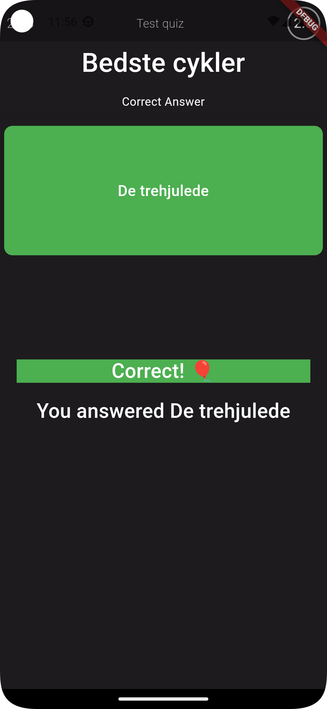

# Quizish

## Quizish is a quiz game, with a full project with backend and frontend for App (Android only).

Quizish is a result of a exam-project between the subjects Mobile Programming and Fullstack
Development, on the 4th semester on EASV.

Some of the features in the App is:

* Create a user.
* Login with a user.
* Login with Google account.
* Edit your username, e-mail and password.
* Create a quiz.
* Join a quiz to play along.
* Host a quiz for others to participate in.
* See others quizzes and be able to play them.

# Short description:

Kahoot is a popular learning tool in which a person, be they a student, teacher, etc., is able to
create and host a quiz for others to participate in. Using Kahoot however requires a bigger screen
for everyone to view the question they are being quizzed on, with the players answering on their
personal device.

The purpose of the application is to create a Kahoot-like platform that will allow users to both
view and answer a given question on their personal device, without major compromises on the user
experience. The application will require an active game session in which up to 50 players should be
able to connect. Google’s Firebase should function as the backend of this system, potentially by
using both Cloud Firestore and Realtime Database.

The game itself consists of a single quiz, which contains 1…n questions and a description. Ideally a
question would also support images. As the game is a competitive quiz, there should also be a
functional scoreboard, keeping track of the users playing. Rather than allowing anonymous users, the
application should support multiple easy authorization solutions through QAuth, with providers such
as Google, Facebook, etc. Following its source of inspiration, the users would ideally still be able
to pick a nickname for each game.

The player should be able to leave a session, and the host should also be able to remove them
themselves. Additionally, the game should have a time incentive, such as a countdown for answering
the current question.

# Screenshots from Flutter app:

    
Login
     

    
Homescreen
     

    
Create Quiz
     

    
Join Quiz
    

 

    
Play Quiz
    
 

 
 
 

    
Update user information
     

### Developed by:

* Andreas Berthelsen
* Jens Bassem Hanna Issa
* Mathias Krarup Madsen
* Rasmus Scherning Sandbæk
